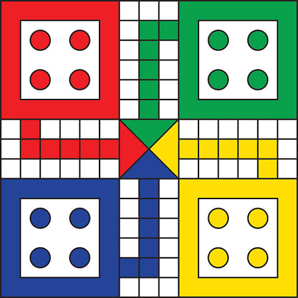

# Online Multiplayer Ludo Game



Welcome to the **Online Multiplayer Ludo Game**, a web-based application that allows players to engage in the classic board game of Ludo with friends and competitors from around the world. Leveraging modern web technologies, this project provides a seamless and interactive gaming experience with real-time updates and competitive leaderboards.

## Table of Contents

- [Features](#features)
- [Technologies Used](#technologies-used)
- [Demo](#demo)
- [Installation](#installation)
- [Setup Instructions](#setup-instructions)
- [Usage](#usage)
- [Contributing](#contributing)
- [License](#license)
- [Troubleshooting](#troubleshooting)
- [Acknowledgments](#acknowledgments)

## Features

- **User Authentication:** Secure registration and login system to manage player accounts.
- **Matchmaking:** Automatic pairing of players for seamless game initiation.
- **Real-Time Gameplay:** Utilize WebSockets for instant updates and interactions between players.
- **Interactive Game Board:** HTML5 Canvas-based Ludo board with dynamic token movements.
- **Leaderboards:** Track and display top players based on wins and losses.
- **Game Logs:** Maintain records of game moves for transparency and review.
- **Responsive Design:** Compatible across various devices and screen sizes.
- **Chat Functionality (Planned):** In-game chat for player communication.

## Technologies Used

- **Frontend:**
  - HTML5 & CSS3
  - JavaScript
  - HTML5 Canvas API
- **Backend:**
  - PHP
  - MySQL
- **Real-Time Communication:**
  - WebSockets (Ratchet Library)
- **Package Management:**
  - Composer
- **Server Environment:**
  - XAMPP/LAMP Stack


## Installation

### Prerequisites

Before you begin, ensure you have met the following requirements:

- **Operating System:** Windows, macOS, or Linux
- **Web Server:** [XAMPP](https://www.apachefriends.org/index.html) or [LAMP](https://bitnami.com/stack/lamp) stack installed
- **Composer:** PHP dependency manager ([Download Composer](https://getcomposer.org/download/))
- **PHP Version:** 7.4 or higher
- **MySQL:** Installed and running

### Clone the Repository

```bash
git clone https://github.com/shakibbinkabir/ludo_game.git
```

Alternatively, download the ZIP file and extract it to your `htdocs` directory.

## Setup Instructions

### 1. Configure the Database

1. **Start XAMPP/LAMP Services:**
   - Open XAMPP Control Panel.
   - Start **Apache** and **MySQL** services.

2. **Access phpMyAdmin:**
   - Navigate to [http://localhost/phpmyadmin/](http://localhost/phpmyadmin/) in your browser.

3. **Import the Database Schema:**
   - Select the `ludo_game` database (if it doesn't exist, create it first).
   - Click on **Import**.
   - Choose the `ludo_game.sql` file located in the **root folder** of the project directory.
   - Click **Go** to execute the import and create all necessary tables.

   > **Note:** The `ludo_game.sql` file contains all the SQL commands required to set up the database schema, including tables for users, games, game players, game tokens, and game moves.

### 2. Install Composer Dependencies

Navigate to the project directory in your terminal and run:

```bash
composer install
```

This command installs all required PHP packages, including the Ratchet library for WebSockets.

### 3. Configure Database Credentials

1. **Open `includes/db.php`:**

   ```php
   <?php
   // includes/db.php
   $servername = "localhost";
   $username = "root"; // Replace with your MySQL username
   $password = "";     // Replace with your MySQL password
   $dbname = "ludo_game";
   
   // Create connection
   $conn = new mysqli($servername, $username, $password, $dbname);
   
   // Check connection
   if ($conn->connect_error) {
       die("Connection failed: " . $conn->connect_error);
   }
   ?>
   ```

2. **Update Credentials:**
   - Replace `$username` and `$password` with your MySQL credentials if they differ from the defaults.

### 4. Place Game Assets

1. **Ludo Board Image:**
   - Add your `ludo_board.png` image to the `images/` directory.
   - Ensure the image dimensions match the Canvas size (`600x600` pixels) or adjust the Canvas size accordingly in the HTML and CSS files.

### 5. Start the WebSocket Server

1. **Open a Terminal Window:**
   - Navigate to the project directory.

2. **Run the WebSocket Server:**

   ```bash
   php server.php
   ```

   - Ensure the server starts without errors and is listening on port `8080`.

   ```
   WebSocket server started.
   WebSocket server listening on port 8080
   ```

   *Note:* Keep this terminal window open as long as you want the WebSocket server to run. To run the server in the background, consider using a process manager like `supervisord` or running it in a separate terminal/tab.

## Usage

### 1. Register a New Account

1. **Navigate to Registration Page:**
   - Open your browser and go to [http://localhost/ludo_game/register.php](http://localhost/ludo_game/register.php).

2. **Fill in Details:**
   - Enter a unique username and a secure password.

3. **Submit the Form:**
   - Upon successful registration, you will be redirected to the login page.

### 2. Log In

1. **Navigate to Login Page:**
   - Go to [http://localhost/ludo_game/login.php](http://localhost/ludo_game/login.php).

2. **Enter Credentials:**
   - Provide your registered username and password.

3. **Access the Dashboard:**
   - Upon successful login, you will be redirected to the main dashboard.

### 3. Start a Game

1. **Matchmaking:**
   - Navigate to [http://localhost/ludo_game/matchmaking.php](http://localhost/ludo_game/matchmaking.php).
   - Click on the **Find a Match** button to enter the matchmaking queue.
   - Once paired with another player, you will be redirected to the game room.

2. **Game Room:**
   - Observe the list of players and the current turn.
   - If it's your turn, click on the **Roll Dice** button to proceed.

3. **Gameplay:**
   - Follow the game prompts to move your tokens based on the dice roll.
   - The game board will update in real-time to reflect moves and captures.

4. **Winning the Game:**
   - The first player to move all their tokens to the home area wins.
   - Upon winning, player statistics are updated, and the leaderboard reflects the new standings.

### 4. View Leaderboard

- Access the leaderboard at [http://localhost/ludo_game/leaderboard.php](http://localhost/ludo_game/leaderboard.php) to see the top players based on wins and losses.

## Contributing

Contributions are welcome! To contribute to this project, follow these steps:

1. **Fork the Repository:**
   - Click the **Fork** button at the top-right corner of this page.

2. **Clone Your Fork:**

   ```bash
   git clone https://github.com/shakibbinkabir/ludo_game.git
   ```

3. **Create a New Branch:**

   ```bash
   git checkout -b feature/YourFeatureName
   ```

4. **Make Your Changes:**
   - Implement your feature or fix.

5. **Commit Your Changes:**

   ```bash
   git commit -m "Add feature: YourFeatureName"
   ```

6. **Push to Your Fork:**

   ```bash
   git push origin feature/YourFeatureName
   ```

7. **Submit a Pull Request:**
   - Navigate to the original repository and click **New Pull Request**.

## License

This project is licensed under the [MIT License](LICENSE).

## Troubleshooting

### Common Issues

1. **WebSocket Connection Errors:**
   - **Issue:** Unable to connect to `ws://localhost:8080`.
   - **Solution:**
     - Ensure the WebSocket server is running (`php server.php`).
     - Verify that port `8080` is open and not blocked by a firewall.
     - Check for any errors in the terminal running the WebSocket server.

2. **Database Connection Errors:**
   - **Issue:** Unable to connect to the database.
   - **Solution:**
     - Verify the database credentials in `includes/db.php`.
     - Ensure MySQL is running.
     - Check if the `ludo_game` database exists and is properly set up.

3. **Syntax Errors in PHP Files:**
   - **Issue:** Errors like "Unclosed '{' on line X".
   - **Solution:**
     - Use an IDE or code editor with PHP syntax highlighting to identify mismatched braces.
     - Run `php -l filename.php` in the terminal to perform a syntax check.

4. **Missing Assets:**
   - **Issue:** Game board image or other assets not displaying.
   - **Solution:**
     - Ensure all assets are placed in the correct directories (`images/`, `css/`, `js/`).
     - Verify the paths in your HTML and CSS files.

5. **Composer Dependencies Not Installed:**
   - **Issue:** Missing libraries like Ratchet.
   - **Solution:**
     - Run `composer install` in the project directory to install all dependencies.

### Enabling Error Reporting

For development purposes, it's helpful to enable detailed error reporting in PHP. **Do not** enable this in a production environment.

1. **Open `php.ini`:**
   - Locate your `php.ini` file (usually in the XAMPP or LAMP installation directory).

2. **Enable Error Display:**
   ```ini
   display_errors = On
   display_startup_errors = On
   error_reporting = E_ALL
   ```

3. **Restart Apache:**
   - After making changes to `php.ini`, restart the Apache server to apply them.

### Logging Errors

Consider implementing error logging to monitor and debug issues:

1. **Enable Error Logging in `php.ini`:**
   ```ini
   log_errors = On
   error_log = "C:/xampp/php/logs/php_error_log.log"  # Update the path as needed
   ```

2. **Check the Error Log:**
   - Review the specified log file for detailed error messages.

## Acknowledgments

- **[Ratchet PHP](http://socketo.me/):** A PHP library for real-time, bi-directional applications between clients and servers over WebSockets.
- **[Composer](https://getcomposer.org/):** Dependency management tool for PHP.
- **[XAMPP](https://www.apachefriends.org/index.html):** A free and open-source cross-platform web server solution stack package.
- **[Ludo Game Rules](https://en.wikipedia.org/wiki/Ludo):** For reference on game mechanics and rules.

---

Feel free to reach out or open an issue if you encounter any problems or have suggestions for improvements!

Happy Gaming! 🎲